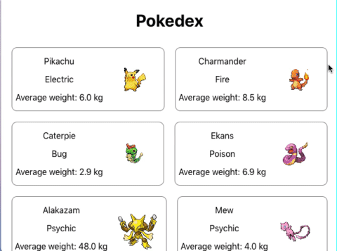

# Exercícios

## Instruções para realização dos exercícios

Crie um novo projeto utilizando npx create-react-app my-pokedex

Para realizar esse exercício, crie um arquivo chamado data.js no diretório .src/ do projeto que você acabou de criar. Copie para esse arquivo o seguinte conteúdo:

```javascript
const pokemons = [
  {
      id: 25,
      name: "Pikachu",
      type: 'Electric',
      averageWeight: {
          value: 6.0,
          measurementUnit: "kg"
      },
      image: "https://cdn2.bulbagarden.net/upload/b/b2/Spr_5b_025_m.png",
      moreInfo: "https://bulbapedia.bulbagarden.net/wiki/Pikachu_(Pok%C3%A9mon)"
  },
  {
      id: 4,
      name: "Charmander",
      type: 'Fire',
      averageWeight: {
          value: 8.5,
          measurementUnit: "kg"
      },
      image: "https://cdn2.bulbagarden.net/upload/0/0a/Spr_5b_004.png",
      moreInfo: "https://bulbapedia.bulbagarden.net/wiki/Charmander_(Pok%C3%A9mon)"
  },
  {
      id: 10,
      name: "Caterpie",
      type: 'Bug',
      averageWeight: {
          value: 2.9,
          measurementUnit: "kg"
      },
      image: "https://cdn2.bulbagarden.net/upload/8/83/Spr_5b_010.png",
      moreInfo: "https://bulbapedia.bulbagarden.net/wiki/Caterpie_(Pok%C3%A9mon)"
  },
  {
      id: 23,
      name: "Ekans",
      type: 'Poison',
      averageWeight: {
          value: 6.9,
          measurementUnit: "kg"
      },
      image: "https://cdn2.bulbagarden.net/upload/1/18/Spr_5b_023.png",
      moreInfo: "https://bulbapedia.bulbagarden.net/wiki/Ekans_(Pok%C3%A9mon)"
  },
  {
      id: 65,
      name: "Alakazam",
      type: 'Psychic',
      averageWeight: {
          value: 48.0,
          measurementUnit: "kg"
      },
      image: "https://cdn2.bulbagarden.net/upload/8/88/Spr_5b_065_m.png",
      moreInfo: "https://bulbapedia.bulbagarden.net/wiki/Alakazam_(Pok%C3%A9mon)"
  },
  {
      id: 151,
      name: "Mew",
      type: 'Psychic',
      averageWeight: {
          value: 4.0,
          measurementUnit: "kg"
      },
      image: "https://cdn2.bulbagarden.net/upload/4/43/Spr_5b_151.png",
      moreInfo: "https://bulbapedia.bulbagarden.net/wiki/Mew_(Pok%C3%A9mon)"
  },
  {
      id: 78,
      name: "Rapidash",
      type: 'Fire',
      averageWeight: {
          value: 95.0,
          measurementUnit: "kg"
      },
      image: "https://cdn2.bulbagarden.net/upload/5/58/Spr_5b_078.png",
      moreInfo: "https://bulbapedia.bulbagarden.net/wiki/Rapidash_(Pok%C3%A9mon)"
  },
  {
      id: 143,
      name: "Snorlax",
      type: 'Normal',
      averageWeight: {
          value: 460.0,
          measurementUnit: "kg"
      },
      image: "https://cdn2.bulbagarden.net/upload/4/40/Spr_5b_143.png",
      moreInfo: "https://bulbapedia.bulbagarden.net/wiki/Snorlax_(Pok%C3%A9mon)"
  },
  {
      id: 148,
      name: "Dragonair",
      type: 'Dragon',
      averageWeight: {
          value: 16.5,
          measurementUnit: "kg"
      },
      image: "https://cdn2.bulbagarden.net/upload/2/2c/Spr_5b_148.png",
      moreInfo: "https://bulbapedia.bulbagarden.net/wiki/Dragonair_(Pok%C3%A9mon)"
  }
];

export default pokemons;
```

## Agora, a prática

Você vai implementar de forma simplificada uma [Pokedex!!](https://bulbapedia.bulbagarden.net/wiki/Pok%C3%A9dex) Para os que não estão familiarizados com o universo Pokemon, a Pokedex é uma enciclopédia de todos os pokemons na natureza. Para o seu caso, a sua aplicação precisa mostrar todos os pokemons presentes no arquivo data.js mencionado acima.

Você pode usar a imaginação para estilizar a sua aplicação. Entretanto, é obrigatório que você implemente pelo menos estes dois componentes:

1. Pokemon: como o próprio nome diz, esse componente representa um pokemon. Esse componente recebe como entrada um objeto que contém informações referentes a um pokemon específico. Esse componente precisa retornar as seguintes informações obrigatórias para serem mostradas para quem usar a aplicação, essas informações devem ser validadas utilizando PropTypes:

   * nome do pokemon;
   * tipo do pokemon;
   * peso médio do pokemon, acompanhado da unidade de medida usada;
   * imagem do pokemon.

2. Pokedex: esse componente representa a enciclopédia de pokemons. Esse componente recebe como entrada uma lista de pokemons para serem mostrados na tela. Para cada um desses pokemons recebidos, Pokedex chama o componente Pokemon.

Segue uma sugestão de implementação da aplicação:



### Esses exercícios foram feitos por [min](https://www.linkedin.com/in/jonathanrei5/) na [Trybe](https://www.betrybe.com/)
