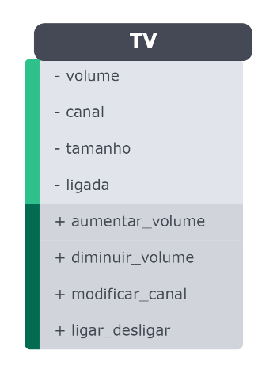
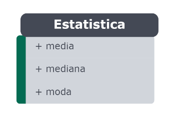
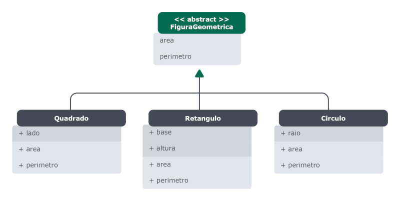
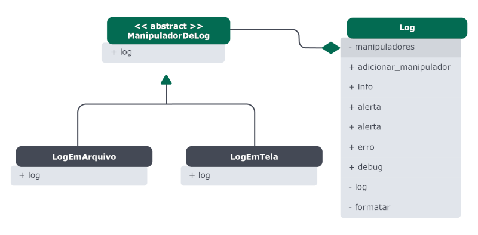

# Exercícios

__Exercício 1:__ Vamos implementar o diagrama abaixo:



Atributos:

`volume` - será inicializado com um valor de 50 e só pode estar entre 0 e 99;

`canal` - será inicializado com um valor de 1 e só pode estar entre 1 e 99;

`tamanho` - será inicializado com o valor do parâmetro;

`ligada` - será inicializado com o valor de `False`, pois está inicialmente desligado.

Todos os atributos devem ser privados.

Métodos:

`aumentar_volume` - aumenta o volume de 1 em 1 até o máximo de 99;

`diminuir_volume` - diminui o volume de 1 em 1 até o mínimo de 0;

`modificar_canal` - altera o canal de acordo com o parâmetro recebido e deve lançar uma exceção (ValueError) caso o valor esteja fora dos limites;

`ligar_desligar` - alterna o estado da TV entre ligado e desligado (`True`/`False`).

__Exercício 2:__ Defina uma classe `Estatistica` que calcule média, mediana e moda de uma lista de números.

Dica: Utilize métodos de classe.



__Exercício 3:__ Lembra do exercício dos gráficos? De semelhante modo, vamos implementar os objetos das seguintes figuras geométricas?



__Exercício 4:__ Implemente um sistemas de logs por nível de severidade, seguindo o diagrama abaixo.



Classe Log

Atributos:

`manipuladores` - Será inicializado com um conjunto de subclasses de `ManipuladorDeLog`;

Métodos:

`adicionar_manipulador` - adiciona um manipulador ao conjunto de manipuladores do gerenciamento de logs (`Log`);

`info` - dispara logs com nível de severidade `"INFO"`;

`alerta` - dispara logs com nível de severidade `"ALERTA"`;

`erro` - dispara logs com nível de severidade `"ERRO"`;

`debug` - dispara logs com nível de severidade `"DEBUG"`;

`__log` - dispara os logs formatados para todos os manipuladores (invocado para cada nível de severidade, para evitar duplicação de código);

`__formatar` - formata os logs de acordo com o padrão “[ERRO - 01/01/2020 13:00:00]: ZeroDivisionError: division by zero”;

A interface de manipulação de logs deve utilizar métodos de classe.

Dica: Você pode utilizar a função `print` em tela ou em arquivo (que pode ter um nome padrão).

__Exercício 5:__ Em um sistema de compras online, temos um código que efetua a compra do pedido. Este código possui *code smells* e precisa ser refatorado. Qual é o *code smell*? Efetue a refatoração do código.

```
class Order:
    def __init__(
        self,
        items,
        credit_card_name,
        credit_card_number,
        credit_card_month,
        credit_card_year,
        credit_card_security_code,
    ):
        self.items = items
        self.credit_card_name = credit_card_name
        self.credit_card_number = credit_card_number
        self.credit_card_month = credit_card_month
        self.credit_card_year = credit_card_year
        self.credit_card_security_code = credit_card_security_code

    # ...
```

### Esses exercícios foram feitos por [min](https://www.linkedin.com/in/jonathan-r-andrade/) na [Trybe](https://www.betrybe.com/)
