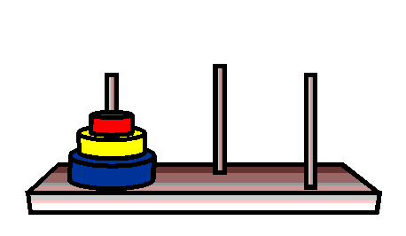

# Exercícios

__Exercício 1:__ Crie um algoritmo não recursivo para contar quantos números pares existem em uma sequência numérica (1 a n).

__Exercício 2:__ Transforme o algoritmo criado acima em recursivo.

__Exercício 3:__ Crie um algoritmo recursivo que encontre, em uma lista, o maior número inteiro.

__Exercício 4:__ Escreva um algoritmo recursivo para encontrar o máximo divisor comum (`mdc`) de dois inteiros.

__Exercício 5:__ Escreva um algoritmo recursivo que identifica se um número é primo.

__Exercício 6:__ Escreva um algoritmo que recebe uma lista e retorne-a na ordem reversa.

## Bônus

__Exercício 7:__ Escreva um algoritmo recursivo que resolva o problema da torre de hanoi, seguindo as instruções:

* Assim como na imagem abaixo, a torre deve conter 3 discos, e três colunas;
* Os discos começam alinhados na primeira coluna, e devem ser organizados respeitando a ordem de tamanho, na última coluna.

### Esses exercícios foram feitos por [min](https://www.linkedin.com/in/jonathan-r-andrade/) na [Trybe](https://www.betrybe.com/)
